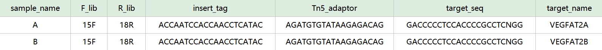
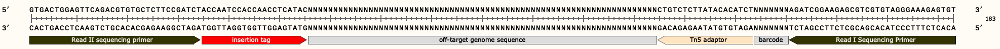
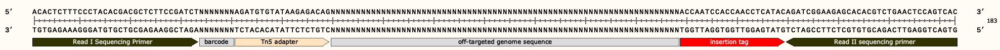

# PEGUIDE

**PEGUIDE** is a complete analysis pipeline for off-target detection with PEAC-seq, which is modified based on [GUIDE-Seq](https://github.com/aryeelab/guideseq) pipeline.
This project requires Python, Perl and the workflow system Snakemake, including adapter trimming, read mapping, duplication filtering, off-target identification and visualization.

## 1. Dependencies

* Perl(v5.30.0)
* Python 3
* Snakemake(v7.8.2)
* bwa(V0.7.17-r1188)
* samtools(V1.10) 
* igvtools(2.15.2) 

## 2. Getting Set up

### 2.1 Install Dependencies

To install dependencies for python, enter the PEGUIDE directory and run:
```bash
pip install -r requirements.txt
```
Snakemake
```bash
#install with conda
conda install -c bioconda -c conda-forge snakemake
#or install with pip
pip3 install snakemake
```
cutadapt(V4.1)
```bash
pip install cutadapt
```
bwa(V0.7.17-r1188)
```bash
git clone https://github.com/lh3/bwa.git
cd bwa
make
```
samtools(V1.10) 
```bash
conda install samtools
```
igvtools(2.15.2) 
```bash
wget https://data.broadinstitute.org/igv/projects/downloads/2.15/IGV_Linux_2.15.2_WithJava.zip
unzip IGV_Linux_2.15.2_WithJava.zip
```

### 2.2 Prepare the input data and the config file
**step1**: To run PEGUIDE, the `input data` needs to follow the standard format we defined.
You can provide the `input data` containing the following columns and save it as a txt/xlsx file, in which the information of each sample is stored in each row. For each sample, PEGUIDE requires paired-end sequencing data of both the forward NGS library used to sequence the downstream region and reverse NGS library used to sequence the upstream region. Upstream and downstream both refer to relative positions of inserted tag in genome.

The example of input data saved as xlsx file looks as follows:

**where**:

* sample_name: is name of the sample
* F_lib: is name of the forward library
* R_lib: is name of the reverse library
* insert_tag: is the full-length insertion sequence of pegRNA(>= 20 bp)
* Tn5_adaptor: is Tn5 mosaic end (ME) sequence(5'-3')
* target_seq: is the target sequence of pegRNA with PAM sequence
* target_name: is name of the targeted gene

The example of forward library sequence:


The example of reverse library sequence:



**step2**: To create the `config file` called config.yaml, you can simply run:
```bash
python /path/to/peguide-master/snakemake_scripts/parse_multi_samples2config.py -i template_input.xlsx -o config.yaml -t 16
```
**required arguments**:

* `-i`  path to input data file
* `-o`  path to output config file

**optional arguments**:

* `-h` show help message and exit
* `-k` the length of insertion tag for trimming adapters
* `-t` the thread number for read mapping

**step3**: Modify the paths necessary for the PEGUIDE pipeline in the `config file`, for example: 
```bash
# Change to your own workspace path
Genome: "GRCh38" # prefix of the reference genome file(fasta) 
Genomedir: "/path/to/hg38" # the absolute path of the directory containing reference genome and index files for bwa
ChromSize: "/path/to/GRCh38.chrom.sizes"  # the absolute path to the file containing chromosome size of the genome, format: chr<tab>length
Bin: "/path/to/peguide-master" # the absolute path to PEGUIDE installed directory
igvtools: "java -Xmx1500m --module-path=/path/to/IGV_Linux_2.15.2/lib @/path/to/IGV_Linux_2.15.2/igv.args --module=org.igv/org.broad.igv.tools.IgvTools" # the absolute path to IGV
```
Description of other parameters in the `config file`, you don't need to set these parameters by your own in principle, which will be generated automatically with `parse_multi_samples2config.py`:
```bash
# Parameter Description
adapters:
  A.15F: # {sample name}.{lib name}
    five_prime_end_read1_adapter: AGATGTGTATAAGAGACAG   # read1 Regular 5’ adapter for adapter trimming
    five_prime_end_read2_adapter: ACCAATCCACCAACC       # read2 Regular 5’ adapter for adapter trimming
    three_prime_end_read1_adapter: GGTTGGTGGATTGGT      # read1 Regular 3’ adapter for adapter trimming
    three_prime_end_read2_adapter: CTGTCTCTTATACACATCT  # read2 Regular 3’ adapter for adapter trimming
extend_seq:
  A:     # sample name 
  - TC   # the 2 bp located at the upstream of 3' end of forward primer
  - GG   # the 2 bp located at the upstream of 3' end of reverse primer
```
### 2.3 Prepare the data directory

Before run the PEGUIDE, create a data directory and store the raw data(fastq) in this directory. 
```bash
cd [your working path]
mkdir data
```
The name of fastq must be consistent to the `input data` you provide previously and follow the naming rules as shown the in the following example.
The data folder in your working directory looks as follows:
```
# data
# ├── [sample_name].[F_lib].1.fastq.gz
# ├── [sample_name].[F_lib].2.fastq.gz
# ├── [sample_name].[R_lib].1.fastq.gz
# ├── [sample_name].[R_lib].2.fastq.gz
```

## 3. Running the PEGUIDE Pipeline
**step1**: To run the PEGUIDE, copy the `config file` and `snakefile` containing the rules for Snakemake to your working directory.
```bash
cd [your working path]
cp /path/to/peguide-master/snakemake_scripts/offtarget_pipeline.smk /path/to/config.yaml .
```
**step2**: Change the `config file` name to your own in the `snakefile`.
```bash
configfile: "config.yaml"
```

**step3**: Add path of the programs to `$PATH` environment variable.
```bash
export PATH=$PATH:/path/to/snakemake
export PATH=$PATH:/path/to/bwa
export PATH=$PATH:/path/to/cutadapt
export PATH=$PATH:/path/to/samtools
```

**step4**: Execute the rules specified in the `snakefile` in the working directory with Snakemake.
For more details of Snakemake, please refer to：https://snakemakecn.readthedocs.io/zh_CN/latest/tutorial/tutorial.html

```bash
snakemake -p -s ./offtarget_pipeline.smk -j 16
```
**required arguments**:

* `-p` output the shell command
* `-s` the file containing the rules for Snakemake, by default the file is located at the current directory
* `-j` specify the number of CPU cores

## 4.Output of PEGUIDE
The example of output looks like:
```bash
barcode_identify/
cutadapt/
bwamem/
guidseqBamDedup/
outputbwa/
A.15F.18R.PEACSeq
A.15F.18R.PEACSeq.bed
A.15F.18R.PEACSeq.DSB2
```
```bash
barcode_identify
├── A.15F.Barcode.1.fastq.gz
├── A.15F.Barcode.2.fastq.gz
├── A.15F.Barcode.barcode.gz
├── A.15F.Barcode.barcode.log.gz
├── A.15F.Barcode.barcodeUMI.saturation
├── A.15F.Barcode.Fragment.saturation
├── A.15F.Barcode.nobarcode.1.fastq.gz
├── A.15F.Barcode.nobarcode.2.fastq.gz
├── A.18R.Barcode.1.fastq.gz
├── A.18R.Barcode.2.fastq.gz
├── A.18R.Barcode.barcode.gz
├── A.18R.Barcode.barcode.log.gz
├── A.18R.Barcode.barcodeUMI.saturation
├── A.18R.Barcode.Fragment.saturation
├── A.18R.Barcode.nobarcode.1.fastq.gz
└── A.18R.Barcode.nobarcode.2.fastq.gz
```

```bash
cutadapt
├── A.15F.1.fastq.clipper.gz
├── A.15F.2.fastq.clipper.gz
├── A.15F.cutadapt
├── A.15F.cutadapt2
├── A.15F.cutadapt2.log
├── A.15F.cutadapt.log
├── A.18R.1.fastq.clipper.gz
├── A.18R.2.fastq.clipper.gz
├── A.18R.cutadapt
├── A.18R.cutadapt2
├── A.18R.cutadapt2.log
└── A.18R.cutadapt.log
```

```bash
bwamem
├── A.15F.PEbwa.bam
└── A.18R.PEbwa.bam
```

```bash
guidseqBamDedup
├── A.15F.nodup.bam.log
├── A.15F.nodup.sort.bam
├── A.15F.nodup.sort.bam.bai
├── A.15F.nodup.tdf
├── A.15F.PEbwa.bam.nodup.bam
├── A.15F.PEbwa.bam.nodup.dup
├── A.15F.PEbwa.bam.nodup.guideseqE.sam
├── A.15F.PEbwa.bam.nodup.nodup.log.summary
├── A.15F.PEbwa.bam.nodup.nodup.wrongIndex
├── A.15F.PEbwa.bam.nodup.unmap
├── A.18R.nodup.bam.log
├── A.18R.nodup.sort.bam
├── A.18R.nodup.sort.bam.bai
├── A.18R.nodup.tdf
├── A.18R.PEbwa.bam.nodup.bam
├── A.18R.PEbwa.bam.nodup.dup
├── A.18R.PEbwa.bam.nodup.guideseqE.sam
├── A.18R.PEbwa.bam.nodup.nodup.log.summary
├── A.18R.PEbwa.bam.nodup.nodup.wrongIndex
└── A.18R.PEbwa.bam.nodup.unmap
```
```bash
outputbwa/
├── identified
│   └── A-15F-18R_identifiedOfftargets.txt
└── visualization
    └── A-15F-18R_identifiedOfftargets_offtargets.svg
```

## Citation
Yu, Z., Lu, Z., Li, J. et al. PEAC-seq adopts Prime Editor to detect CRISPR off-target and DNA translocation. Nat Commun 13, 7545 (2022). https://doi.org/10.1038/s41467-022-35086-8

## Contact
malabdata@westlake.edu.cn
